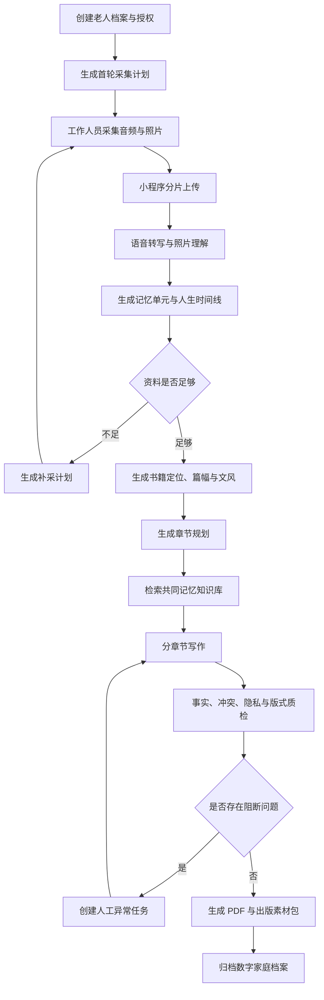
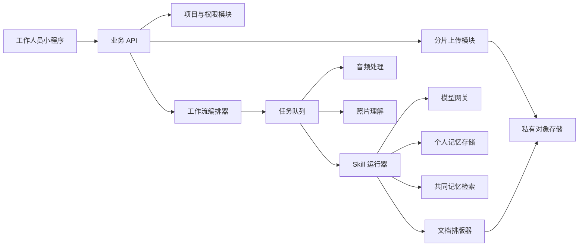

# AI 老年人回忆录平台设计

日期：2026-07-28

状态：已完成产品设计，等待书面复核

默认仓库：`https://github.com/Nevermore222/Sangyu-record.git`

## 1. 项目目标

本项目面向愿意为父母或长辈保存人生故事的家庭。工作人员在线下按照系统生成的计划采集老人录音、老照片和必要备注，上传后由自动化流水线完成转写、资料理解、人生事件整理、补采判断、章节规划、写作、质检、排版和 PDF 输出。

首期目标不是建立公共回忆录社区，而是跑通一条可信、可追溯、可重复执行的回忆录生产流程。正常项目无需人工编辑即可生成成果；只有低置信度、事实冲突、敏感内容或处理失败时才创建人工异常任务。

底层交付物是可持续补充的数字家庭档案，PDF 回忆录是该档案的首个成品输出。后续可以扩展实体出版、人物纪录片、家庭问答智能体等能力。

## 2. 已确认的产品决策

- 付费方：老人的子女或家庭。
- 首期直接用户：工作人员；老人和家属不设独立账号。
- 标准输入：音频、老照片和工作人员备注；视频仅预留类型。
- 采访方式：首次自由讲述，系统整理后自动生成后续追问和补采计划。
- 写作方式：忠实润色，不虚构对话、心理活动、场景或个人经历。
- 观点冲突：老人原始讲述永久保留，家属或工作人员补充独立保存，不覆盖原始材料。
- 数据共享：家庭资料默认私有；只有被逐条授权的记忆片段才能匿名进入共同记忆库。
- 自动化边界：正常数据自动输出；低置信、矛盾或敏感内容触发人工处理。
- 输出：数字家庭档案、电子 PDF、家庭打印 PDF 和出版素材包。

## 3. 设计原则

### 3.1 原始证据不可覆盖

原始音频、照片和工作人员备注是最高层级证据。模型生成的逐字稿、事件、章节和背景说明都是派生数据，不能覆盖原始文件。

### 3.2 个人记忆与时代背景分离

系统可以使用共同记忆知识库介绍交通、教育、物价、风俗和工作制度等时代环境，但不得由公共资料反推老人一定经历过某件事。

### 3.3 生成内容可追溯

每个个人事实必须关联到音频时间戳、照片、实物信息或工作人员备注。缺少个人来源的具体经历不得进入自动发布版本。

### 3.4 自动化采用确定性编排

工作流引擎按照固定依赖调用版本化 Skills。Skills 不自由决定业务流程，也不能访问任务声明范围之外的数据。

### 3.5 素材决定体量

素材不足时缩减章节和篇幅，或者生成补采计划。系统不得通过重复表达或虚构细节满足目标字数。

## 4. 产品角色

### 4.1 工作人员

- 创建老人项目并记录授权。
- 执行系统生成的采访和照片采集计划。
- 使用小程序录音、拍照、添加时间点备注并上传物料。
- 只处理系统无法自动解决的异常任务。
- 下载和交付最终成果。

### 4.2 老人

- 参与线下采访。
- 决定隐私内容能否收录或共享。
- 其原始讲述不被他人修改覆盖。

### 4.3 家属

- 购买服务并协助提供资料。
- 首期通过工作人员提交补充意见和照片，不直接操作系统。
- 不得覆盖老人的原始叙述。

### 4.4 自动化系统

- 生成采集和补采计划。
- 处理音频、照片和文本。
- 组织个人记忆和时代背景。
- 编排 Skills 完成策划、写作、质检和排版。
- 自动完成正常项目，隔离并上报高风险异常。

## 5. 核心数据对象

| 对象 | 职责 |
| --- | --- |
| 老人档案 | 保存项目代号、基本资料、家庭概况和隐私配置 |
| 授权记录 | 独立记录录制、AI 处理、家庭使用、出版和匿名共享权限 |
| 采集计划 | 保存本轮问题、照片任务、证明材料和完成状态 |
| 采访批次 | 记录采集时间、地点、工作人员、设备和批次状态 |
| 原始物料 | 保存音频、照片、备注及文件指纹，内容不可覆盖 |
| 转写结果 | 保存逐字稿、阅读稿、说话人、时间戳和置信度 |
| 记忆单元 | 保存人物、时间、地点、事件、情绪、来源和冲突状态 |
| 背景资料 | 保存年代、地区、行业或生活主题资料及可用范围 |
| 书籍方案 | 保存定位、篇幅、视角、文风、章节和照片策略 |
| 回忆录版本 | 保存结构化书稿、来源映射、质检结果和导出文件 |
| 异常任务 | 保存阻断原因、影响范围、处理动作和恢复节点 |

## 6. 端到端工作流



项目状态为：

```text
建档中
→ 待采集
→ 物料上传中
→ 自动处理中
→ 等待补采
→ 书籍生成中
→ 自动质检中
→ 异常待处理
→ PDF生成中
→ 已完成
```

`等待补采` 和 `异常待处理` 可以返回处理流程。新增资料后只重跑受影响的时间线、章节和质检节点。

## 7. 采集计划与小程序

### 7.1 首次建档

工作人员录入姓名或项目代号、出生年份、出生地、长期生活地区、主要职业、家庭概况、计划采访次数、目标体量和共享授权。系统据此生成首轮计划。

### 7.2 计划单内容

- 必采主题：童年、家庭、求学、工作、婚姻、子女、重大转折和晚年。
- 推荐追问：根据地区、职业、年代和已有资料动态生成。
- 关键人物：姓名、关系、相识过程和代表故事。
- 时间锚点：出生、入学、就业、迁居、结婚和退休。
- 照片任务：童年照、全家福、工作照、结婚照、旧居和重要物件。
- 现场备注：方言、情绪、不愿讨论的话题和待补充事项。

每个计划项包含 `待采集`、`已采集`、`资料不足` 或 `无需采集` 状态。

### 7.3 首期页面

1. 项目列表：阶段、资料完整度、异常数量和更新时间。
2. 创建项目：基础档案、授权和成书目标。
3. 采集计划：本轮问题、追问、照片任务和历史缺口。
4. 现场采集：录音、暂停续录、时间点备注、拍照和照片选择。
5. 上传中心：分片上传、断点续传、失败重试和本地暂存。
6. 自动处理进度：展示当前工作流节点。
7. 异常任务：展示必须人工处理的问题和要求。
8. 成果页面：预览、下载、查看来源和创建补充版本。

### 7.4 补采判断

系统按人生阶段空白、人物故事完整度、事件要素、照片关联、个人内容密度、时间冲突和目标篇幅所需素材量判断是否补采。达到预设补采次数仍不完整时缩减书籍方案，不生成虚构内容。

## 8. 物料处理

### 8.1 音频

处理步骤为：

```text
文件校验 → 降噪与分段 → 说话人区分 → 语音转写
→ 时间戳对齐 → 标点与段落整理 → 实体识别 → 置信度标记
```

系统保留忠实原话的逐字稿和改善阅读性的阅读稿。每句话关联音频起止时间。方言、重叠语音、低置信人名和听不清片段进入异常判断。

### 8.2 照片

系统检查画质、方向和重复项，执行 OCR，识别人像数量、服饰、建筑、环境和物件，生成候选描述和图注，并尝试关联人物与事件。照片模型的推断不能直接升级为个人事实。

### 8.3 记忆单元

每条记忆单元至少包含原始叙述、人物关系、时间范围、地点、事件经过、结果、情绪、关联音频、关联照片、信息来源、置信度、权限和冲突状态。

## 9. 共同记忆知识库

知识库按 `年代 × 地区 × 行业或职业 × 生活主题 × 历史事件` 组织。

允许来源包括：

- 获得逐条授权并匿名化的口述片段。
- 公开地方志、年鉴和博物馆资料。
- 获得许可的历史书籍和档案。
- 人工整理且记录来源的年代生活资料。
- 合作机构提供的合规资料。

知识库只返回与当前章节匹配且处于允许使用范围的背景。所有背景资料保留出处、适用地区、适用年份、可信等级和授权信息。

## 10. 来源模型

生成段落在后台保留以下来源类型：

- `P`：老人亲述。
- `F`：家属或工作人员补充。
- `I`：照片或实物信息。
- `K`：共同记忆知识库。
- `R`：AI 对既有资料的重组表达。

具体个人经历只有 `K` 或 `R` 来源时，自动质检必须阻止发布。最终 PDF 可以隐藏技术标签，但后台必须能回溯证据，并可以生成资料来源附录。

## 11. Skills 编排

### 11.1 编排顺序

```text
material-assessment
→ memoir-positioning
→ timeline-builder
→ chapter-planner
→ shared-memory-retrieval
→ chapter-writer
→ chapter-fact-check
→ cross-chapter-consistency
→ privacy-review
→ book-editor
→ pdf-layout
```

### 11.2 Skill 契约

每个 Skill 声明结构化输入输出、允许读取的数据、模型配置、Skill 版本、成功条件、最大重试次数和失败降级方式。执行记录保存模型、参数、提示配置、输入摘要、输出位置、成本和耗时。

### 11.3 分阶段写作

1. 生成全书时间线和人物关系。
2. 根据素材密度确定书籍定位和章节结构。
3. 为每章建立可使用事实包。
4. 检索与该章匹配的背景资料。
5. 写作章节并保存段落来源映射。
6. 检查无来源事实、重复、冲突和敏感内容。
7. 统一全书称谓、时间、口吻和衔接。
8. 根据照片质量和内容关联完成排版。
9. 通过最终质量门后生成成果文件。

章节写作只能读取该章事实包、必要的全书摘要和获准的背景资料，以减少跨章节事实混淆。

## 12. 自动质量门与降级

以下情况创建人工异常任务：

- 关键音频转写置信度过低。
- 同一人物存在无法合并的身份信息。
- 重大事件年份互相矛盾。
- 照片人物识别缺少证据。
- 章节出现无个人资料来源的具体经历。
- 内容涉及疾病、财产、犯罪或第三方隐私。
- 背景资料来源不可靠或相互冲突。
- 图片损坏、PDF 失败或版面溢出。

非关键问题自动降级。例如照片年份无法精确确认时使用模糊时间描述，而不是阻断全书。

模型调用失败时自动重试并可切换备用模型；Skill 输出格式错误时允许自动修复后重试；单章失败只重跑该章；质检失败携带问题返回对应写作节点；超过重试上限才创建异常任务。

## 13. 后台模块



首期可以采用模块化单体后端加独立异步 Worker，不要求提前拆成大量微服务。工作流、媒体处理和模型任务通过队列隔离，以便后续独立扩容。

### 13.1 任务可靠性

所有耗时任务具备唯一编号、幂等控制、进度、重试次数、错误原因、输入输出校验、超时策略、中间结果持久化、单节点重跑和暂停恢复。文件指纹用于识别重复上传，避免重复处理和计费。

### 13.2 存储边界

- 音频、原图、缩略图、PDF 和素材包进入私有对象存储。
- 档案、授权、任务、记忆单元和书籍结构进入关系数据库。
- 可检索资料进入语义索引，但索引不代替原始文本和来源记录。
- 家庭项目与共同记忆库使用独立命名空间和权限。
- 下载使用短时有效链接。
- 项目删除覆盖数据库、索引、派生文件和原始文件，并保留不含内容的审计结果。

## 14. PDF 与出版素材

系统先生成与版式无关的结构化书稿，包含封面、序言、章节、后记、段落层级、图片、图注、人生年表、可选人物关系、内部来源映射和权限信息。

排版器输出：

- 适合移动设备查看的电子 PDF。
- 适合家庭打印的标准 PDF。
- 包含结构化书稿、高清照片和字体信息的出版素材包。

首期不直接接入出版社。未来可以扩展出血、色彩配置和印刷规格，而无需重新生成回忆录内容。

## 15. 授权与安全

授权分别覆盖录制、服务器和 AI 处理、家庭查看、纸质制作、片段匿名共享、模型评估或产品改进。拒绝共享不影响回忆录服务。

安全要求包括：

- 家庭项目隔离，工作人员只访问被分配项目。
- 原始音频、照片和身份信息加密存储。
- 模型接口必须满足数据不留存要求，或使用私有部署。
- Skill 按任务最小权限读取数据。
- 日志不记录完整敏感信息和长期有效下载地址。
- 下载、删除、重新生成和授权变更进入审计日志。
- 共享片段移除姓名、精确地址、联系方式和可识别关系后再复核。
- 高风险第三方、医疗、财产、犯罪和家庭矛盾内容不得进入共同记忆库。

## 16. 测试策略

### 16.1 确定性测试

覆盖项目状态、授权、权限、上传、幂等、任务重试、版本管理、删除流程和来源映射。

### 16.2 Skill 契约测试

每个 Skill 使用固定样例验证输入输出、缺失字段、失败降级和版本兼容。

### 16.3 AI 评估集

使用虚构或明确授权样本评估转写准确性、实体提取、事实覆盖、无来源事实、背景误用、文风一致性和敏感内容识别。

### 16.4 端到端测试

从建档、上传到 PDF 下载，覆盖断网续传、模型超时、重复任务、补采循环、异常恢复和局部重跑。

PDF 自动检查页数、字体嵌入、缺图、空白页、图片分辨率和文本溢出，并通过页面截图进行视觉回归。

## 17. 首期范围

### 17.1 包含

- 工作人员小程序。
- 档案、授权、采集计划和补采闭环。
- 音频与照片上传、转写和理解。
- 记忆单元、时间线和人物关系。
- 私有个人资料库和独立共同记忆知识库。
- Skills 注册、编排、策划、写作和质检。
- 异常任务处理、版本、审计、PDF 和出版素材包。

### 17.2 不包含

- 老人或家属账号。
- 视频采访和纪录片剪辑。
- 支付、订单、出版社下单和物流。
- 公共回忆录社区。
- 家庭问答智能体、声音克隆和数字人。
- 复杂家族知识图谱。
- 第三方在线协作编辑。

## 18. 验收标准

使用一套完整的模拟老人资料验收：

1. 建档后自动生成首轮采集计划。
2. 多段音频和照片在断网后可恢复上传。
3. 系统生成带时间戳来源的逐字稿和记忆单元。
4. 素材不足时生成第二轮补采计划。
5. 补采完成后自动规划篇幅、文风和章节。
6. 每项个人事实可追溯到音频、照片或备注。
7. 共同记忆只作为背景，不伪装成老人亲历。
8. 正常数据无需人工介入即可输出完整 PDF。
9. 人物、年份和隐私冲突进入异常任务。
10. 修复异常后只重跑受影响节点。
11. PDF 不存在乱码、缺图、文本溢出或明显版式错误。
12. 全流程可查看所用模型、Skill、知识来源、成本和耗时。

## 19. 完成条件

项目同时满足以下条件后进入 `已完成`：

- 关键音频均已成功转写。
- 书稿达到与素材匹配的完整度。
- 每项个人事实存在可追溯来源。
- 高风险冲突已解决或相关内容已移除。
- 敏感内容符合授权范围。
- 背景资料通过来源检查。
- PDF 无缺图、乱码、空页和文本溢出。
- 成果文件已写入存储并能通过授权链接下载。

## 20. 后续阶段

本设计批准后的下一步是编写实施计划。实施计划需要先确定技术栈、部署环境、首批模型与已有 Skills 清单，再把首期范围拆成可验证的开发任务。任何后续功能扩展都应以本设计中的来源追踪、隐私隔离和自动质量门为约束。
