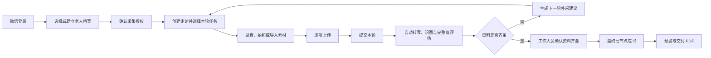

# 桑榆录工作人员小程序系统设计

**日期：** 2026-07-30  
**状态：** 已完成交互确认，待书面规格复核  
**范围：** 工作人员采集端、小程序所需 Go 后端扩展、本地联调与生产部署模板

## 1. 目标

建设一套适合工作人员在公园、养老院和老人家中反复使用的微信小程序，完整覆盖：

1. 微信身份登录；
2. 建立老人档案并确认采集授权；
3. 生成和查看采集计划；
4. 创建多轮走访；
5. 直接录音、拍照，或从微信文件和相册导入外部设备素材；
6. 逐项上传、失败重试和草稿恢复；
7. 每轮上传后自动转写、识图、评估完整度并生成补采建议；
8. 工作人员确认资料齐备后启动最终七节点成书流程；
9. 查看处理进度并预览、转发 PDF；
10. 完成本地 Docker 联调，并提供公网体验版和生产部署配置。

本项目继续只负责业务流程、数据、上传、编排、校验和交付。Media、Knowledge、Agent 能力仍通过现有异步 Provider API 调用，不在本仓库内实现模型、知识库或智能体。

## 2. 明确不做

- 老人或家属端；
- 运营管理后台；
- 视频录制、导入或处理；
- 完整离线数据库和双向同步引擎；
- 在线排版编辑器；
- 出版社订单、支付和物流；
- 在缺少 AppID、AppSecret 和备案域名时宣称已正式发布。

首版允许短时断网下继续本轮采集，但不承诺跨设备离线协作。

## 3. 用户与产品原则

唯一目标用户是经过授权的线下采集工作人员。老人和家属是被采集对象，不登录系统。

产品遵循以下原则：

- **任务优先：** 首页首先展示需要工作人员采取行动的项目，而不是装饰性统计。
- **档案内闭环：** 计划、走访、素材、分析、补采和成书都围绕同一老人档案组织。
- **逐项可靠：** 每个音频和照片独立保存、上传和重试，单项失败不使整轮作废。
- **人机边界清晰：** 每轮素材可以自动分析，但最终成书必须由工作人员确认。
- **不暴露模型术语：** 小程序使用“分析中、待补采、可成书”等业务语言。
- **隐私优先：** 未确认老人或家属授权时，不能开始录音或拍照。

## 4. 信息架构

### 4.1 底部导航

底部只保留三个稳定入口：

| 入口 | 内容 |
|---|---|
| 工作台 | 今日待办、待补采、处理中、可成书和最近档案 |
| 档案 | 搜索、状态筛选和全部老人档案 |
| 我的 | 工作人员身份、所属团队、当前环境、隐私说明和退出登录 |

### 4.2 页面清单

| 页面 | 主要职责 |
|---|---|
| 微信登录 | 调用 `wx.login`，建立工作人员会话并处理未授权状态 |
| 工作台 | 聚合需要行动的项目，进入最近档案或新建档案 |
| 档案列表 | 服务端分页、关键字搜索和状态筛选 |
| 新建档案 | 两步填写身份背景和回忆录目标，随后确认采集授权 |
| 老人档案 | 查看总体进度、计划、历次走访、最终流程和 PDF |
| 走访准备 | 选择本轮采集主题，查看建议提问和应采照片 |
| 现场采集 | 管理多段录音、多张照片、现场备注和上传队列 |
| 轮次报告 | 展示摘要、已覆盖任务、资料缺口和下一轮建议 |
| 自动成书 | 展示七个业务阶段、失败原因和重试动作 |
| 成果交付 | 展示 PDF 版本、大小和生成时间，支持预览与转发 |

### 4.3 主流程



## 5. 视觉与交互

采用用户确认的 **C「人物志」**方向：白色主背景、克制的编辑出版感和明确的操作层级。

### 5.1 视觉令牌

| 用途 | 值 |
|---|---|
| 正文 | `#292423` |
| 品牌与关键动作 | `#6E2834` |
| 成功与可信状态 | `#356048` |
| 警告 | `#B66530` |
| 页面辅助底色 | `#F3F5F2` |
| 分割线 | `#D9DCD8` |
| 展示字体 | `Songti SC`, `STSong`, serif |
| 正文字体 | `PingFang SC`, `Microsoft YaHei`, sans-serif |
| 控件圆角 | `4px` 至 `8px`，不使用胶囊化页面容器 |

页面不使用装饰性渐变、悬浮大卡片或营销式 Hero。老人照片和实际素材缩略图是主要视觉内容；无照片时使用姓名首字头像。

### 5.2 交互规则

- 高频主按钮固定在安全区上方，但不遮挡内容；
- 录音、拍照、导入、删除和重试使用熟悉图标加短标签；
- 状态标签必须同时使用文字，不只依赖颜色；
- 技术节点映射为业务阶段，例如 `retrieve_shared_memory` 显示为“补充时代背景”；
- 处理页面轮询时保持布局稳定，不因状态文字变化发生跳动；
- 未上传完退出现场采集页时必须二次确认；
- 最终成书使用确认弹层，明确成书后仍可继续追加走访并生成新版本。

## 6. 数据模型

### 6.1 新增实体

#### Staff

- `id uuid`
- `wechat_openid text unique`
- `display_name text`
- `team_name text`
- `state active|disabled`
- `created_at`, `updated_at`

生产环境通过 `STAFF_OPENID_ALLOWLIST` 引导首批工作人员；登录成功后写入或更新 `staff`。首版不建设管理后台。

#### StaffSession

- `id uuid`
- `staff_id uuid`
- `token_hash text unique`
- `expires_at timestamptz`
- `created_at`, `last_seen_at`

客户端只保存随机会话令牌，数据库只保存哈希。退出登录或工作人员停用时会话失效。

#### Consent

- `id uuid`
- `project_id uuid`
- `confirmed_by elder|guardian`
- `confirmation_method onsite`
- `staff_id uuid`
- `confirmed_at timestamptz`

项目可以先建立，但没有有效 Consent 时不能创建走访或发起素材上传。

#### Visit

- `id uuid`
- `project_id uuid`
- `sequence integer`
- `staff_id uuid`
- `visited_at timestamptz`
- `location text`
- `notes text`
- `state draft|submitted|analyzing|completed|failed`
- `error_code text nullable`
- `created_at`, `updated_at`

同一项目的 `sequence` 唯一且单调递增。

#### VisitPlanItem

- `visit_id uuid`
- `plan_item_id uuid`

记录本轮走访准备覆盖的采集任务。

#### VisitAnalysis

- `id uuid`
- `visit_id uuid unique`
- `summary text`
- `covered_items jsonb`
- `gaps jsonb`
- `followup_questions jsonb`
- `created_at`, `updated_at`

`covered_items`、`gaps` 和 `followup_questions` 在进入数据库前必须经过任务级规范化器校验。

### 6.2 现有实体扩展

- `projects` 增加 `owner_staff_id`；
- `assets` 增加 `visit_id`、`source direct|wechat_file|album|camera` 和原始显示名；
- 素材与采集任务通过 `asset_plan_items(asset_id, plan_item_id)` 多对多关联；
- `collection_plan_items` 保持现有 `pending|collected|insufficient|not_needed` 状态，并增加 `gap_reason`；
- Provider job、attempt、最终 workflow run 和 artifact 继续沿用现有表和恢复机制。

## 7. API 设计

身份入口位于 `/v1/auth`，受保护的工作人员业务接口位于 `/v1/staff`。除登录接口外均要求 `Authorization: Bearer <session-token>`。

### 7.1 身份

| 方法 | 路径 | 行为 |
|---|---|---|
| POST | `/v1/auth/wechat` | 接收 `wx.login` code，调用微信 code2Session，校验 allowlist 并创建会话 |
| POST | `/v1/auth/dev` | 仅 `AUTH_MODE=dev` 可用，创建本地工作人员会话 |
| GET | `/v1/staff/me` | 返回当前工作人员 |
| POST | `/v1/staff/logout` | 撤销当前会话 |

生产环境禁止启用 `/v1/auth/dev`。微信 AppSecret 只存在后端环境变量中。

### 7.2 工作台与项目

| 方法 | 路径 | 行为 |
|---|---|---|
| GET | `/v1/staff/dashboard` | 返回待行动统计和最近档案 |
| GET | `/v1/staff/projects?query=&state=&cursor=&limit=20` | 服务端搜索、筛选和游标分页 |
| POST | `/v1/staff/projects` | 复用现有建档接口 |
| GET | `/v1/staff/projects/{projectID}` | 返回档案、计划、走访摘要和最终流程摘要 |
| POST | `/v1/staff/projects/{projectID}/consents` | 记录老人或家属现场授权 |

### 7.3 走访

| 方法 | 路径 | 行为 |
|---|---|---|
| POST | `/v1/staff/projects/{projectID}/visits` | 创建走访草稿，接收地点、时间和 plan item IDs |
| GET | `/v1/staff/projects/{projectID}/visits` | 按 sequence 倒序返回走访摘要 |
| GET | `/v1/staff/visits/{visitID}` | 返回走访、素材、上传状态和分析结果 |
| PATCH | `/v1/staff/visits/{visitID}` | 更新草稿备注、地点和计划任务 |
| POST | `/v1/staff/visits/{visitID}:submit` | 校验素材后提交本轮分析，幂等 |
| POST | `/v1/staff/visits/{visitID}:retry` | 仅重试失败的轮次分析步骤 |

### 7.4 素材

现有上传票据和完成接口保留，初始化请求扩展以下字段：

```json
{
  "visit_id": "uuid",
  "kind": "audio",
  "source": "direct",
  "filename": "第一次进厂.mp3",
  "content_type": "audio/mpeg",
  "size_bytes": 123456,
  "plan_item_ids": ["uuid"]
}
```

新增 `GET /v1/staff/visits/{visitID}/assets` 查询素材，新增 `POST /v1/staff/assets/{assetID}:renew-upload` 为同一未完成素材续发上传票据。未完成素材允许通过 `DELETE /v1/staff/assets/{assetID}` 删除；已完成的不可变素材在首版中不能删除或覆盖。

### 7.5 分析与成书

| 方法 | 路径 | 行为 |
|---|---|---|
| GET | `/v1/staff/visits/{visitID}/analysis` | 返回本轮摘要、覆盖项、缺口和补采问题 |
| POST | `/v1/staff/projects/{projectID}:finalize` | 要求确认参数，启动现有最终工作流 |
| GET | `/v1/staff/projects/{projectID}/workflow` | 复用现有最终流程查询 |
| GET | `/v1/staff/projects/{projectID}/artifacts/latest` | 复用现有 PDF 查询 |

`:finalize` 内部调用现有 workflow service，不建立第二套最终成书状态机。

## 8. 自动处理流程

### 8.1 每轮分析

1. Visit 提交后进入 `submitted`；
2. 为本轮音频调用 Media `audio_transcription`；
3. 为本轮照片调用 Media `photo_understanding`；
4. 聚合规范化结果，调用 Agent `material_assessment`；
5. 调用 Agent `followup_plan`；
6. 校验结果后写入 VisitAnalysis；
7. 以同一数据库事务更新 collection plan item 状态和 gap reason；
8. Visit 进入 `completed`，失败则进入 `failed` 并保留已完成 Provider job。

本期为 `material_assessment` 和 `followup_plan` 增加任务级输出规范化器，不放宽未知 task type 的处理。

### 8.2 最终成书

工作人员调用 `:finalize` 前必须满足：

- 项目有有效 Consent；
- 没有未提交的走访草稿；
- 至少有一个已完成音频和一个已完成照片；
- 请求体显式包含 `confirm_materials_ready: true`。

满足后复用现有七节点流程：转写、照片理解、整理记忆、检索共同记忆、写作、审校、PDF 渲染。

## 9. 小程序客户端结构

保持微信原生小程序和 TypeScript，不引入跨端框架。新增边界：

- `services/api.ts`：纯 HTTP 契约；
- `services/session.ts`：微信登录、令牌保存和一次性会话刷新；
- `services/upload-queue.ts`：持久文件、逐项上传、续票和重试；
- `services/drafts.ts`：当前设备上的走访草稿索引；
- `domain/presenters.ts`：将后端枚举映射为中文文案和视觉状态；
- `components/`：状态标签、空状态、素材行、进度步骤和固定操作栏；
- `pages/`：按第 4 节页面清单组织。

录音结束后立即调用 `wx.saveFile`。上传成功并完成服务端确认后才删除本地持久文件。导入音频使用微信文件选择器；照片同时支持相机和相册。

## 10. 错误处理

| 场景 | 行为 |
|---|---|
| 会话过期 | 刷新会话并重放一次请求，仍失败则回到登录页 |
| 上传票据过期 | 调用 `POST /v1/staff/assets/{assetID}:renew-upload` 后继续 |
| 单项上传失败 | 保留本地文件和其他成功项，只显示当前项重试 |
| 小程序退出 | 保存走访草稿和本地文件映射，再次进入自动恢复 |
| 轮次分析失败 | 展示可行动错误，重试只恢复未完成 Provider job |
| 最终流程失败 | 沿用持久化节点恢复，不重复已经成功的节点 |
| PDF 打开失败 | 保留下载入口，提示检查网络并允许再次下载 |

客户端不无限重试。所有自动重试必须有明确上限，之后交给用户触发。

## 11. 隐私与安全

- 录音、照片和备注属于敏感个人资料；
- 未记录 Consent 时后端拒绝创建走访和发放上传票据；
- 日志不得记录微信 code、session key、Bearer token、签名 URL、录音文字或照片识别正文；
- Provider 继续只获得短期、只读、单素材签名 URL；
- Knowledge 和 Agent Provider 不获得对象存储 URL；
- 生产 API、对象下载域名和 Provider callback 全部使用 HTTPS；
- 微信 AppSecret、Provider token、数据库和对象存储凭据只通过服务端 secret 注入；
- 本地 `AUTH_MODE=dev` 必须绑定 loopback 或显式开发网络，生产配置启动时拒绝 dev auth。

## 12. 测试策略

### 12.1 Go

- Staff session、allowlist 和鉴权 middleware 单元测试；
- 项目列表分页与搜索仓库测试；
- Consent、Visit、素材关联和 VisitAnalysis 仓库测试；
- 走访状态转换、幂等提交和失败恢复测试；
- 新增 Provider 输出规范化器测试；
- 未授权、无 Consent、素材不足和重复 finalize 的 handler 测试。

### 12.2 小程序

- API 路径、Bearer token、错误解析测试；
- session 刷新只重放一次测试；
- upload queue 的持久化、续票、单项重试和完成清理测试；
- presenter 的状态文案和进度计算测试；
- 页面关键状态的组件测试或确定性渲染快照；
- TypeScript `tsc --noEmit`。

### 12.3 端到端

扩展 `scripts/vertical-slice.ps1`，以 dev staff 身份完成：

1. 登录；
2. 新建档案和 Consent；
3. 创建两次 Visit；
4. 上传多段音频和多张照片；
5. 提交轮次并验证补采建议；
6. finalize 项目；
7. 验证三类 Provider job、审计响应、七个最终节点和 PDF；
8. 验证 API 健康状态。

微信开发者工具用于真实录音、相册、文件选择、PDF 打开和视觉检查；这些能力不能只用 Node 单元测试替代。

## 13. 部署

### 13.1 本地

新增统一启动脚本，执行：依赖检查、Docker Compose 构建、迁移、Go/Node/TypeScript 测试、健康检查，并输出 `miniapp/project.config.json` 导入路径。

本地配置使用：

- `AUTH_MODE=dev`；
- `API_BASE_URL=http://localhost:8080`；
- 现有 Mock Provider；
- 微信开发者工具关闭开发阶段域名校验。

若检测到微信开发者工具 CLI 且用户已开启服务端口，启动脚本可以自动打开项目；否则输出准确的手工导入步骤。

### 13.2 生产与体验版

提供：

- 生产 Compose 覆盖文件；
- HTTPS 反向代理模板；
- `.env.production.example`；
- 数据库迁移和健康检查命令；
- 微信合法域名、体验版上传和发布检查清单。

生产必填：

- `WECHAT_APP_ID`、`WECHAT_APP_SECRET`；
- `STAFF_OPENID_ALLOWLIST`；
- `SESSION_SECRET`；
- HTTPS API 域名；
- HTTPS 对象上传与下载域名；
- 三类 Provider URL/token 和 callback 公网地址；
- PostgreSQL、Redis 和 S3/MinIO 凭据。

正式发布前必须在微信公众平台配置 request、uploadFile 和 downloadFile 合法域名，并保证这些域名的 TLS 证书有效。

## 14. 验收标准

- 工作人员能通过微信或本地 dev 模式登录；
- 首页加载服务端真实项目，不依赖本地 project ID 列表；
- 能建立档案、记录授权并得到初始采集计划；
- 能创建多轮走访并恢复当前设备上的未完成草稿；
- 能直接录音、拍照、导入音频和照片；
- 素材逐项上传，失败可单独重试；
- 每轮提交后生成经过校验的摘要、覆盖项、缺口和补采问题；
- 工作人员确认后能跑完最终工作流并打开 PDF；
- 本地启动脚本通过，服务保持运行；
- 生产部署模板不包含明文真实 secret；
- Go 测试、`go vet`、Mock Provider 测试、小程序测试、类型检查和扩展后的端到端验收全部通过。
